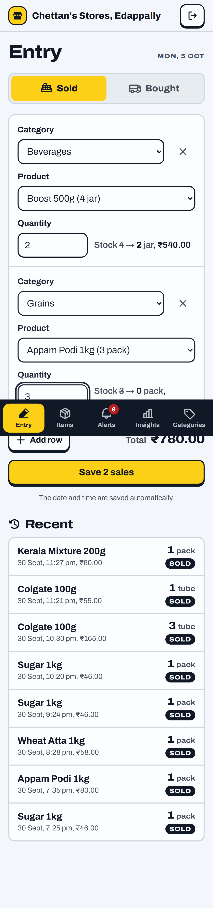
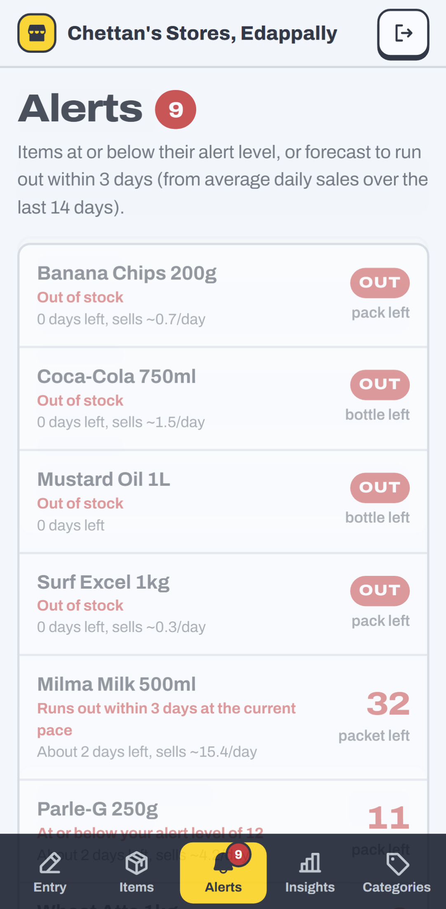
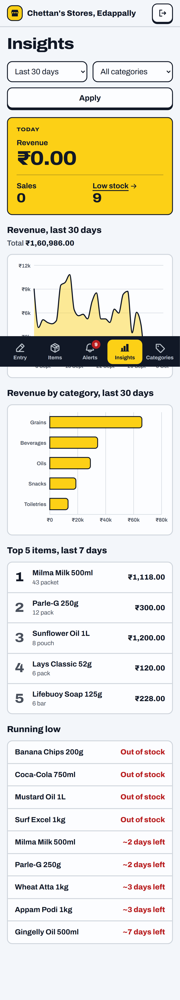
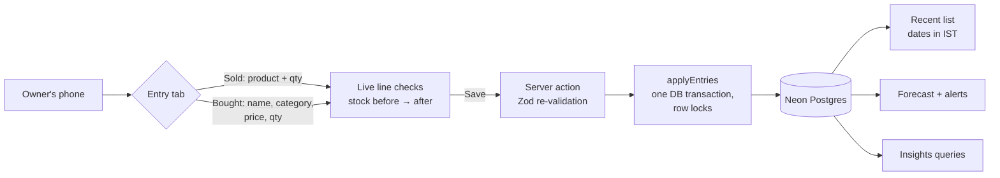

# StockSense

Inventory tracking for small shops in Kochi. The Entry page has two tabs: **Sold** (category →
product → quantity) and **Bought** (name, category, price, quantity). Stock updates on Save, and the
date and time are stored automatically. Low-stock alerts use a simple sales-pace forecast, and an
Insights page shows sales trends.

**Live demo:** https://stocksense-zeta-seven.vercel.app (sign in with demo@stocksense.local / demo1234)

| Entry                                | Alerts                                 | Insights                                   |
| ------------------------------------ | -------------------------------------- | ------------------------------------------ |
|  |  |  |

## Stack

Next.js 16 (App Router, server actions) · TypeScript · Tailwind v4 · Drizzle ORM on Neon Postgres ·
Auth.js v5 (credentials + optional Google, JWT sessions) · Recharts · Motion · Phosphor Icons ·
Vitest · Playwright

## Setup

Requires Node 22+.

```sh
npm install
cp .env.example .env        # fill in DATABASE_URL and AUTH_SECRET (npx auth secret)
npm run db:migrate
npm run db:seed             # demo shop: demo@stocksense.local / demo1234
npm run dev
```

## Environment variables

| Key                                   | Required | Purpose                                                        |
| ------------------------------------- | -------- | -------------------------------------------------------------- |
| `DATABASE_URL`                        | yes      | Neon Postgres connection string (pooled)                       |
| `AUTH_SECRET`                         | yes      | Signs session JWTs                                             |
| `AUTH_GOOGLE_ID`/`AUTH_GOOGLE_SECRET` | no       | Enables "Continue with Google"                                 |
| `LLM_API_KEY`                         | no       | LLM parser for `eval:parser` (not used by the app since M8)    |
| `LLM_PROVIDER`/`LLM_MODEL`            | no       | Default `groq` / `llama-3.3-70b-versatile` (OpenAI-compatible) |
| `LLM_BASE_URL`/`LLM_TIMEOUT_MS`       | no       | Custom endpoint; timeout (default 10000)                       |

## Scripts

| Script                                   | What it does                                                           |
| ---------------------------------------- | ---------------------------------------------------------------------- |
| `dev` / `build` / `start`                | Next.js                                                                |
| `lint` / `typecheck` / `format`          | ESLint, `tsc --noEmit`, Prettier                                       |
| `test`                                   | Vitest unit tests; DB integration tests run when `DATABASE_URL` is set |
| `test:e2e`                               | Playwright: signup → login → Sold tab → Bought tab → stock updated     |
| `eval:parser`                            | Scores the parser on 44 sample entries                                 |
| `db:generate` / `db:migrate` / `db:seed` | Drizzle migrations and the demo shop                                   |

## Architecture



- **Shop scoping.** Every query takes the shop id from the session (`getCurrentShopId()` in
  `src/lib/shop.ts`), never from the client. Ids sent by the client (item, category) are re-checked
  against the shop. `src/lib/data/*` holds all DB access.
- **Entry.** Lines are checked live in the browser (`src/lib/entry-rows.ts`) and again on the server
  (`soldEntriesSchema` / `boughtEntriesSchema`), so each tab can only send its own kind of line. On
  Bought, a name that exactly matches an existing item (ignoring case) restocks it and a changed price
  updates it; a new name creates the item, counted in pcs. The date is the row's `created_at`.
- **Ledger.** Stock changes and their transaction rows are written in one DB transaction. A CHECK
  constraint keeps stock from going negative. Overselling needs an explicit override, recorded as an
  adjustment plus the sale.

## Forecast

`src/lib/forecast.ts` is pure and unit-tested.

- Sales are bucketed per IST calendar day over the last 14 complete days (today is partial, so it's
  left out). A newer item uses its age instead, so a 5-day-old item averages over 5 days.
- Rate = average units per day. Days left = stock ÷ rate. No sales means no forecast (it won't run out).
- An item is low when stock ≤ its alert level, or it's forecast to run out within 3 days.
- Items with under 3 days of history are labelled "rough guess".
- EWMA (alpha 0.3) was also tried. A backtest on simulated history (`scripts/backtest-forecast.ts`,
  9,222 cases, against the next 7 days' actual sales) gave mean absolute error 0.64 units/day for the
  plain average vs 0.80 for EWMA, so the average is the default.

## Parser eval

Until milestone 8 the Entry page read typed notes ("sold 2 matta rice, randu coke vittu") with a
rules or LLM parser. It now uses the Sold / Bought forms instead. The parser (`src/lib/parser`) is
kept with its eval and tests but isn't called by the app. The owner's text goes to the LLM inside
`<entry>` tags with tag characters stripped, and the reply must pass a Zod schema.

`npm run eval:parser` runs 44 entries (plain English, typos, Manglish, several items, missing
quantities, ambiguous names, pack sizes, alert levels, new items) through parse and match, and counts
an entry right only if every line matches. Ambiguous names must produce a question, not a guess.

Rules parser, 2026-10-03: **42/44 entries (95.5%), 50/52 lines (96.2%)**. The two misses
("chaya podi", "customer took 3 …") become questions on the card, not wrong saves. A unit test keeps
a 90% floor in CI. The LLM parser is scored too when `LLM_API_KEY` is set.

## Known limitations

- Bought's price is the selling price. There's no cost price, so no margins.
- Items added on Bought start in pcs with alert level 0. Change both on the item page.
- Bought matches names exactly: "Sugar 1 kg" and "Sugar 1kg" are different items. The name box
  suggests existing names to help avoid this.
- The LLM parser hasn't been scored yet, and the parser isn't used by the app since milestone 8.
- The forecast was tuned on simulated, fairly steady demand. Festival seasons and weekly patterns
  aren't modelled. Revisit with real shop data.
- One shop per owner, no staff accounts or roles.
- Needs a connection: there's no offline entry.
- English UI only.
- E2E tests need a real database, so CI runs lint, typecheck and unit tests only.
